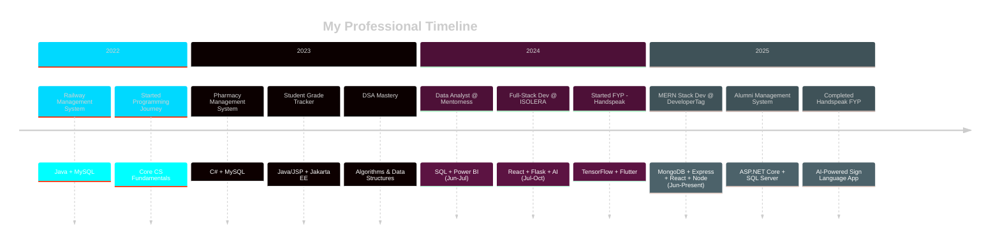

<div align="center">

[](https://git.io/typing-svg)

[](https://git.io/typing-svg)

<br/>

<!-- Social Badges -->
<a href="https://zainulabideenportfolio.netlify.app/">
  
</a>
<a href="https://www.linkedin.com/in/zain688/">
  
</a>
<a href="mailto:zainm2432003@gmail.com">
  
</a>
<a href="https://www.upwork.com/freelancers/~01d018f9ca9768b53d?mp_source=share">
  
</a>

<br/><br/>

<!-- Profile Stats Badges -->


</div>

<br/>

---

<!-- About Section -->


##  &nbsp;About Me

```javascript
const zain = {
    fullName: "Muhammad Zain Ul Abideen",
    title: "Full-Stack Developer & AI Enthusiast",
    location: "Pakistan 🇵🇰",
    
    currentRole: {
        position: "MERN Stack Developer Intern",
        company: "DeveloperTag",
        since: "June 2025"
    },
    
    education: "BS Computer Science",
    
    expertise: {
        frontend: ["React", "Next.js", "Flutter", "Tailwind CSS"],
        backend: ["Node.js", "Express", "Flask", "ASP.NET"],
        databases: ["MongoDB", "MySQL", "SQL Server", "Firebase"],
        ai_ml: ["TensorFlow", "OpenCV", "Python", "Data Analytics"],
        tools: ["Git", "Docker", "Postman", "Power BI"]
    },
    
    currentlyLearning: ["Cloud Architecture", "DevOps", "Advanced ML"],
    
    goals2025: [
        "Contribute to impactful open source projects",
        "Master cloud-native development",
        "Build AI products that help millions"
    ],
    
    lifePhilosophy: "Code with purpose, design with empathy"
};
```

<br clear="right"/>

---

##  &nbsp;Tech Arsenal

<div align="center">


</div>

###  &nbsp;Languages & Frameworks

<div align="center">
<table>
<tr>
<td align="center" width="110">

<br><b>JavaScript</b>
</td>
<td align="center" width="110">

<br><b>TypeScript</b>
</td>
<td align="center" width="110">

<br><b>Python</b>
</td>
<td align="center" width="110">

<br><b>C#</b>
</td>
<td align="center" width="110">

<br><b>Java</b>
</td>
<td align="center" width="110">

<br><b>React</b>
</td>
</tr>
<tr>
<td align="center" width="110">

<br><b>Next.js</b>
</td>
<td align="center" width="110">

<br><b>Node.js</b>
</td>
<td align="center" width="110">

<br><b>Express</b>
</td>
<td align="center" width="110">

<br><b>Flask</b>
</td>
<td align="center" width="110">

<br><b>ASP.NET</b>
</td>
<td align="center" width="110">

<br><b>Flutter</b>
</td>
</tr>
</table>
</div>

###  &nbsp;Databases & Cloud

<div align="center">
<table>
<tr>
<td align="center" width="110">

<br><b>MySQL</b>
</td>
<td align="center" width="110">

<br><b>MongoDB</b>
</td>
<td align="center" width="110">

<br><b>PostgreSQL</b>
</td>
<td align="center" width="110">

<br><b>Firebase</b>
</td>
<td align="center" width="110">

<br><b>Supabase</b>
</td>
<td align="center" width="110">

<br><b>Redis</b>
</td>
</tr>
</table>
</div>

###  &nbsp;Frontend & Styling

<div align="center">
<table>
<tr>
<td align="center" width="110">

<br><b>HTML5</b>
</td>
<td align="center" width="110">

<br><b>CSS3</b>
</td>
<td align="center" width="110">

<br><b>Tailwind</b>
</td>
<td align="center" width="110">

<br><b>SASS</b>
</td>
<td align="center" width="110">

<br><b>Bootstrap</b>
</td>
<td align="center" width="110">

<br><b>Material UI</b>
</td>
</tr>
</table>
</div>

###  &nbsp;Tools & DevOps

<div align="center">
<table>
<tr>
<td align="center" width="110">

<br><b>GitHub</b>
</td>
<td align="center" width="110">

<br><b>Docker</b>
</td>
<td align="center" width="110">

<br><b>Git</b>
</td>
<td align="center" width="110">

<br><b>VS Code</b>
</td>
<td align="center" width="110">

<br><b>Postman</b>
</td>
<td align="center" width="110">

<br><b>Figma</b>
</td>
</tr>
</table>
</div>

###  &nbsp;AI/ML & Data Science

<div align="center">
<table>
<tr>
<td align="center" width="110">

<br><b>TensorFlow</b>
</td>
<td align="center" width="110">

<br><b>PyTorch</b>
</td>
<td align="center" width="110">

<br><b>OpenCV</b>
</td>
<td align="center" width="110">

<br><b>Pandas</b>
</td>
<td align="center" width="110">

<br><b>NumPy</b>
</td>
<td align="center" width="110">

<br><b>Scikit-Learn</b>
</td>
</tr>
</table>
</div>

---

##  &nbsp;GitHub Analytics

<div align="center">


</div>

### Performance Dashboard

<p align="center">
  
  
</p>

### Language Analytics

<p align="center">
  
  
</p>

### Contribution Activity

<p align="center">
  <a href="https://github.com/MuhammadZain243">
    
  </a>
</p>

### Achievement Showcase

<p align="center">
  
</p>

### Contribution Heatmap

<p align="center">
  
</p>

### Detailed Metrics

<div align="center">

<table>
<tr>
<td align="center">

**Contribution Stats**

| Metric | Count |
|:---:|:---:|
| Public Repos |  |
| Total Stars |  |
| Followers |  |
| Total Commits |  |

</td>
<td align="center">

**Activity Stats**

| Category | Value |
|:---:|:---:|
| Pull Requests | `75+` |
| Issues Resolved | `40+` |
| Projects Completed | `15+` |
| Achievements | `10+` |

</td>
</tr>
</table>

</div>

---

##  &nbsp;Professional Journey

<div align="center">

</div>



### Experience Timeline

<table>
<tr>
<td width="50%">

<div align="center">

### DeveloperTag
**MERN Stack Developer Intern**


</div>

```yaml
 Key Responsibilities:
  ├── Full-stack MERN development
  ├── RESTful API architecture
  ├── Reusable React components
  ├── MongoDB database design
  └── CI/CD & Git workflows

 Tech Stack:
  ├── MongoDB, Express.js
  ├── React.js, Node.js
  ├── JWT Authentication
  └── Tailwind CSS, Material UI

 Impact:
  └── Contributing to production apps
      serving thousands of users
```

</td>
<td width="50%">

<div align="center">

### ITSOLERA
**Full-Stack Development Intern**


</div>

```yaml
 Key Responsibilities:
  ├── React frontend development
  ├── Flask backend services
  ├── AI model integrations
  ├── Performance optimization
  └── Feature deployment

 Tech Stack:
  ├── React.js, Flask
  ├── Python, REST APIs
  ├── AI/ML Integration
  └── Docker, Git

 Impact:
  └── Shipped 5+ major features
      improving UX significantly
```

</td>
</tr>
<tr>
<td width="50%">

<div align="center">

### Mentorness
**Data Analyst Intern**


</div>

```yaml
 Key Responsibilities:
  ├── Power BI dashboard creation
  ├── Complex SQL optimization
  ├── Data visualization
  └── Insight generation

 Tech Stack:
  ├── Power BI, SQL Server
  ├── Excel, DAX
  └── Statistical Analysis

 Impact:
  └── Delivered 3 interactive
      dashboards for stakeholders
```

</td>
<td width="50%">

<div align="center">

### Career Highlights

</div>

```yaml
 Milestones Achieved:
  ├── 15+ Production Projects
  ├── 3 Professional Internships
  ├── AI-Powered FYP Completed
  ├── Full-Stack Expertise
  └── Data Analytics Certified

Recognition:
  ├── Top Performer @ ISOLERA
  ├── Data Analytics Champion
  └── BS Computer Science

Strengths:
  ├── Problem Solving
  ├── Quick Learner
  └── Team Collaboration
```

</td>
</tr>
</table>

---

##  &nbsp;Featured Projects

<div align="center">

</div>

### Handspeak — Urdu Sign Language Translation

<div align="center">


</div>

<table>
<tr>
<td width="60%">

> **Final Year Project (2024-2025)**
>
> A comprehensive AI-powered solution bridging communication gaps between the deaf community and others through real-time Urdu Sign Language translation.

** System Architecture:**

```
┌──────────────────────────────────────────────────┐
│                 HANDSPEAK SYSTEM                 │
├──────────────────────────────────────────────────┤
│  Presentation Layer                              │
│  └── Flutter Cross-Platform Mobile App           │
│      ├── iOS & Android Support                   │
│      └── Real-time Camera Processing             │
├──────────────────────────────────────────────────┤
│  AI/ML Processing Layer                          │
│  ├── TensorFlow Gesture Recognition Model        │
│  ├── OpenCV Real-time Video Processing           │
│  ├── Custom CNN Architecture                     │
│  └── 1000+ Sign Dataset (Self-curated)           │
├──────────────────────────────────────────────────┤
│  Translation Engine                              │
│  ├── Sign → Text Conversion                      │
│  ├── Text → Speech (TTS)                         │
│  ├── Text → 3D Sign Animation                    │
│  └── Bi-directional Translation Pipeline         │
├──────────────────────────────────────────────────┤
│  Data Layer                                      │
│  └── Firebase Real-time Database                 │
└──────────────────────────────────────────────────┘
```

</td>
<td width="40%">

**Project Details:**

| Aspect | Details |
|:---|:---|
| **Category** | AI/ML + Mobile |
| **Team Size** | 4 Members |
| **My Role** | Lead Developer |
| **Accuracy** | 95%+ |

**Tech Stack:**


**Key Features:**

- Real-time gesture detection
- Bi-directional translation
- 3D sign animations
- Cross-platform support
- Text-to-speech output
- Learning analytics

</td>
</tr>
</table>

---

### Alumni Management System

<div align="center">


</div>

<table>
<tr>
<td width="60%">

> **Enterprise Solution (May 2025)**
>
> A comprehensive web platform for managing alumni networks, events, job postings, and analytics for educational institutions.

** System Architecture:**

```
┌──────────────────────────────────────────────────┐
│           ALUMNI MANAGEMENT SYSTEM               │
├──────────────────────────────────────────────────┤
│  Presentation Layer                              │
│  ├── ASP.NET Core MVC                            │
│  ├── Razor Pages + Bootstrap 5                   │
│  └── Responsive Dashboard UI                     │
├──────────────────────────────────────────────────┤
│  Business Logic Layer                            │
│  ├── Identity & Role Management                  │
│  ├── Event Scheduling Service                    │
│  ├── Job Portal Management                       │
│  ├── Alumni Directory Service                    │
│  └── Analytics & Reporting                       │
├──────────────────────────────────────────────────┤
│  Data Access Layer                               │
│  ├── Entity Framework Core                       │
│  ├── Repository Pattern                          │
│  └── SQL Server Database                         │
└──────────────────────────────────────────────────┘
```

</td>
<td width="40%">

**Project Details:**

| Aspect | Details |
|:---|:---|
| **Category** | Full-Stack Web |
| **Architecture** | MVC Pattern |
| **My Role** | Solo Developer |
| **Users** | 500+ |

**Tech Stack:**


**Key Features:**

- Role-based authentication
- Event management system
- Job posting portal
- Analytics dashboard
- Alumni directory
- Email notifications

</td>
</tr>
</table>

---

### Other Notable Projects

<div align="center">
<table>
<tr>
<td width="50%" align="center">

### Pharmacy Management System
**Desktop Application (Jan 2023)**


```
Medicine inventory management
Patient records system
Stock level monitoring
Sales & billing module
Report generation
```

</td>
<td width="50%" align="center">

### Railway Management System
**Enterprise System (2022)**


```
Employee CRUD operations
Train scheduling system
Ticket booking & cancellation
Seat reservation
Refund processing
```

</td>
</tr>
<tr>
<td width="50%" align="center">

### Student Grade Tracker
**Web Application (2023)**


```
Grade management system
GPA/CGPA calculation
Attendance visualization
Secure authentication
Performance analytics
```

</td>
<td width="50%" align="center">

### Coming Soon...
**Next Big Thing (2025)**


```
Something exciting is brewing...
AI-powered innovation
Full-stack excellence
Stay tuned!
```

</td>
</tr>
</table>
</div>

---

##  &nbsp;Services I Offer

<div align="center">

```
╔═══════════════════════════════════════════════════════════════════════════════════╗
║                              PROFESSIONAL SERVICES                                ║
║                     Turning Your Ideas Into Digital Reality                       ║
╚═══════════════════════════════════════════════════════════════════════════════════╝
```

</div>

<table>
<tr>
<td width="33%" align="center">

### Web Development


**Full-Stack Solutions**

```
MERN Stack Applications
Next.js & React Apps
REST API Development
JWT Authentication
Database Architecture
AI/ML Integrations
CMS (Strapi/Sanity)
Cloud Deployment
Performance Optimization
```

</td>
<td width="33%" align="center">

### Custom Software


**Desktop & Systems**

```
Windows Applications
Cross-platform Apps
Database Integration
File Handling Systems
System Programming
Algorithm Design
GUI Development
Automation Scripts
API Development
```

</td>
<td width="33%" align="center">

### Code Services


**Quality & Performance**

```
Code Optimization
Performance Tuning
Bug Fixing
Code Reviews
Refactoring
Security Audits
Testing & QA
Documentation
Technical Support
```

</td>
</tr>
</table>

[](https://www.upwork.com/freelancers/~01d018f9ca9768b53d?mp_source=share)
[](mailto:zainm2432003@gmail.com)
[](mailto:zainm2432003@gmail.com)

</div>

---

##  &nbsp;Let's Connect

<div align="center">


### Open for Opportunities & Collaborations

<br/>

<a href="https://zainulabideenportfolio.netlify.app/">
  
</a>
&nbsp;
<a href="https://www.linkedin.com/in/zain688/">
  
</a>
&nbsp;
<a href="mailto:zainm2432003@gmail.com">
  
</a>
&nbsp;
<a href="https://github.com/MuhammadZain243">
  
</a>

<br/><br/>

| Email | LinkedIn | Portfolio | Upwork |
|:---:|:---:|:---:|:---:|
| [zainm2432003@gmail.com](mailto:zainm2432003@gmail.com) | [/in/zain688](https://www.linkedin.com/in/zain688/) | [Visit Site](https://zainulabideenportfolio.netlify.app/) | [Hire Me](https://www.upwork.com/freelancers/~01d018f9ca9768b53d) |

</div>

---


<div align="center">

### If you like my work, consider giving a ⭐


<br/><br/>

**"The only way to do great work is to love what you do."** — *Steve Jobs*

<br/>


</div>
