<div align="center">

[](https://git.io/typing-svg)

[](https://git.io/typing-svg)

<br/>

<!-- Social Badges -->
<a href="https://zainulabideenportfolio.netlify.app/">
  
</a>
<a href="https://www.linkedin.com/in/zain688/">
  
</a>
<a href="mailto:zainm2432003@gmail.com">
  
</a>
<a href="https://www.upwork.com/freelancers/~01d018f9ca9768b53d?mp_source=share">
  
</a>

<br/><br/>

<!-- Profile Stats Badges -->


</div>

<br/>

---

<!-- About Section -->


##  &nbsp;About Me

```javascript
const zain = {
    fullName: "Muhammad Zain Ul Abideen",
    title: "Full-Stack Developer & Security Platform Architect",
    location: "Lahore, Punjab, Pakistan 🇵🇰",
    
    currentRole: {
        position: "Associate - Full Stack Development",
        company: "DeveloperTag Associates",
        focus: "Enterprise Security & Multi-tenant Platforms",
        since: "June 2024"
    },
    
    education: {
        degree: "BS Computer Science",
        status: "Senior Year",
        focus: ["AI/ML", "Full-Stack Development", "Cloud Architecture"]
    },
    
    activeProjects: {
        production: [
            "GuardX - Security Operations Platform",
            "Cypentra - Cybersecurity Consulting Website",
            "E-commerce Solutions with Payment Gateways",
            "Online Quran Academy Platforms",
            "BizLifeLine Business Solutions"
        ],
        experimental: [
            "MessySheets - Excel Data Intelligence Tool",
            "QHT - Quantum Health Token (Blockchain)",
            "Advanced JWT Authentication Systems"
        ]
    },
    
    expertise: {
        frontend: [
            "React 18", "Next.js 14", "TypeScript", 
            "Tailwind CSS", "Material-UI", "GSAP Animations",
            "Responsive Design", "Component Architecture"
        ],
        backend: [
            "NestJS", "Node.js", "Express.js",
            "Prisma ORM", "TypeORM", "JWT/OAuth",
            "RESTful APIs", "Microservices"
        ],
        databases: [
            "PostgreSQL", "MongoDB", "MySQL",
            "Firebase", "Supabase", "Redis"
        ],
        cloud_devops: [
            "AWS (S3, EC2, RDS)", "Railway", "Vercel",
            "Docker", "Git/GitHub", "CI/CD Pipelines"
        ],
        ai_ml: [
            "TensorFlow", "OpenCV", "Python",
            "Data Analytics", "Computer Vision",
            "Natural Language Processing"
        ],
        specializations: [
            "Multi-tenant Architecture",
            "Role-Based Access Control (RBAC)",
            "Security Operations Management",
            "Payment Gateway Integration",
            "Real-time Data Systems"
        ]
    },
    
    designPhilosophy: {
        colors: ["Blue/White Professional Themes", "Clean Minimalism"],
        principles: [
            "Mobile-first responsive design",
            "Performance optimization (<3s load time)",
            "Accessibility standards (WCAG)",
            "Component reusability",
            "Code maintainability (<300 lines per file)"
        ]
    },
    
    currentlyLearning: [
        "Advanced Cloud Architecture (AWS Solutions Architect)",
        "GraphQL & Apollo Server",
        "Microservices with Docker & Kubernetes",
        "Advanced Security Patterns & Threat Detection",
        "Real-time WebSocket Applications"
    ],
    
    goals2025: [
        "Launch GuardX platform to 100+ security companies",
        "Contribute to major open source security projects",
        "Master AWS & achieve certification",
        "Build AI-powered security analytics tools",
        "Scale consulting business with Cypentra"
    ],
    
    workingStyle: {
        codeQuality: "Clean architecture, extensive testing",
        collaboration: "Agile methodology, daily standups",
        problemSolving: "Research-driven, performance-focused",
        communication: "Clear documentation, knowledge sharing"
    },
    
    lifePhilosophy: "Code with purpose, design with empathy, secure by default"
};
```

<br clear="right"/>

---

##  &nbsp;Tech Arsenal

<div align="center">


</div>

###  &nbsp;Languages & Frameworks

<div align="center">
<table>
<tr>
<td align="center" width="110">

<br><b>JavaScript</b>
</td>
<td align="center" width="110">

<br><b>TypeScript</b>
</td>
<td align="center" width="110">

<br><b>Python</b>
</td>
<td align="center" width="110">

<br><b>C#</b>
</td>
<td align="center" width="110">

<br><b>Java</b>
</td>
<td align="center" width="110">

<br><b>React</b>
</td>
</tr>
<tr>
<td align="center" width="110">

<br><b>Next.js</b>
</td>
<td align="center" width="110">

<br><b>Node.js</b>
</td>
<td align="center" width="110">

<br><b>NestJS</b>
</td>
<td align="center" width="110">

<br><b>Express</b>
</td>
<td align="center" width="110">

<br><b>Flask</b>
</td>
<td align="center" width="110">

<br><b>Prisma ORM</b>
</td>
</tr>
<tr>
<td align="center" width="110">

<br><b>ASP.NET</b>
</td>
<td align="center" width="110">

<br><b>Flutter</b>
</td>
<td align="center" width="110">

<br><b>GraphQL</b>
</td>
<td align="center" width="110">

<br><b>WebSocket</b>
</td>
<td align="center" width="110">

<br><b>Solidity</b>
</td>
<td align="center" width="110">

<br><b>Jest</b>
</td>
</tr>
</table>
</div>

###  &nbsp;Databases & Cloud

<div align="center">
<table>
<tr>
<td align="center" width="110">

<br><b>MySQL</b>
</td>
<td align="center" width="110">

<br><b>MongoDB</b>
</td>
<td align="center" width="110">

<br><b>PostgreSQL</b>
</td>
<td align="center" width="110">

<br><b>Firebase</b>
</td>
<td align="center" width="110">

<br><b>Supabase</b>
</td>
<td align="center" width="110">

<br><b>Redis</b>
</td>
</tr>
<tr>
<td align="center" width="110">

<br><b>AWS</b>
</td>
<td align="center" width="110">

<br><b>Vercel</b>
</td>
<td align="center" width="110">

<br><b>Railway</b>
</td>
<td align="center" width="110">

<br><b>Cloudflare</b>
</td>
<td align="center" width="110">

<br><b>Netlify</b>
</td>
<td align="center" width="110">

<br><b>Heroku</b>
</td>
</tr>
</table>
</div>

###  &nbsp;Frontend & Styling

<div align="center">
<table>
<tr>
<td align="center" width="110">

<br><b>HTML5</b>
</td>
<td align="center" width="110">

<br><b>CSS3</b>
</td>
<td align="center" width="110">

<br><b>Tailwind</b>
</td>
<td align="center" width="110">

<br><b>SASS</b>
</td>
<td align="center" width="110">

<br><b>Bootstrap</b>
</td>
<td align="center" width="110">

<br><b>Material UI</b>
</td>
</tr>
<tr>
<td align="center" width="110">

<br><b>Figma</b>
</td>
<td align="center" width="110">

<br><b>SVG</b>
</td>
<td align="center" width="110">

<br><b>GSAP</b>
</td>
<td align="center" width="110">

<br><b>Three.js</b>
</td>
<td align="center" width="110">

<br><b>Framer Motion</b>
</td>
<td align="center" width="110">

<br><b>Vite</b>
</td>
</tr>
</table>
</div>

###  &nbsp;Tools & DevOps

<div align="center">
<table>
<tr>
<td align="center" width="110">

<br><b>GitHub</b>
</td>
<td align="center" width="110">

<br><b>Docker</b>
</td>
<td align="center" width="110">

<br><b>Git</b>
</td>
<td align="center" width="110">

<br><b>VS Code</b>
</td>
<td align="center" width="110">

<br><b>Postman</b>
</td>
<td align="center" width="110">

<br><b>Notion</b>
</td>
</tr>
<tr>
<td align="center" width="110">

<br><b>Linux</b>
</td>
<td align="center" width="110">

<br><b>Bash</b>
</td>
<td align="center" width="110">

<br><b>Nginx</b>
</td>
<td align="center" width="110">

<br><b>Webpack</b>
</td>
<td align="center" width="110">

<br><b>NPM</b>
</td>
<td align="center" width="110">

<br><b>Yarn</b>
</td>
</tr>
</table>
</div>

###  &nbsp;AI/ML & Data Science

<div align="center">
<table>
<tr>
<td align="center" width="110">

<br><b>TensorFlow</b>
</td>
<td align="center" width="110">

<br><b>PyTorch</b>
</td>
<td align="center" width="110">

<br><b>OpenCV</b>
</td>
<td align="center" width="110">

<br><b>Pandas</b>
</td>
<td align="center" width="110">

<br><b>NumPy</b>
</td>
<td align="center" width="110">

<br><b>Scikit-Learn</b>
</td>
</tr>
</table>
</div>

---

##  &nbsp;Professional Journey

<div align="center">

</div>



```mermaid
%%{init: {'theme': 'dark', 'themeVariables': { 'primaryColor': '#00D9FF', 'primaryTextColor': '#fff', 'primaryBorderColor': '#00D9FF', 'lineColor': '#6C63FF', 'secondaryColor': '#0D1117', 'tertiaryColor': '#0D1117'}}}%%
timeline
    title My Professional & Project Timeline
    
    section 2022
        Railway Management System : Java + MySQL Desktop App
        Started Programming Journey : Core CS Fundamentals
        Built Foundation : OOP + Data Structures
    
    section 2023
        Pharmacy Management System : C# + MySQL + WinForms
        Student Grade Tracker : Java/JSP + Jakarta EE
        DSA Mastery : Algorithms & Problem Solving
        Started Web Development : HTML + CSS + JavaScript
    
    section 2024 Q1-Q2
        Web Development Focus : React + Node.js
        Data Analyst @ Mentorness : SQL + Power BI (Jun-Jul)
        Full-Stack Dev @ ITSOLERA : React + Flask + AI (Jul-Oct)
        Started Multiple Projects : E-commerce + Business Sites
    
    section 2024 Q3-Q4
        Started FYP - Handspeak : TensorFlow + Flutter + AI
        GuardX Platform Development : Multi-tenant Security System
        Cypentra Website : Cybersecurity Consulting Platform
        Advanced Backend : NestJS + Prisma + PostgreSQL
        Payment Integrations : Stripe + PayPal
    
    section 2025 Q1
        Associate @ DeveloperTag : Full-Stack Enterprise Solutions
        Alumni Management System : ASP.NET Core + SQL Server
        Completed Handspeak FYP : AI Sign Language Translation
        BizLifeLine Platform : Business Automation Tools
        MessySheets Tool : Excel Intelligence System
        Advanced Security : RBAC + JWT + OAuth Implementation
        
    section 2025 Q2 (Current)
        GuardX Production Ready : Multi-tenant Security Platform
        Online Quran Academies : Education Platform Development
        Cloud Deployment Mastery : AWS + Railway + Vercel
        Real-time Systems : WebSocket + Event-driven Architecture
```

### Current Role & Responsibilities

<div align="center">

```yaml
Position: Associate - Full-Stack Development
Company: DeveloperTag Associates
Duration: June 2024 - Present
Location: Remote, Pakistan

Core Responsibilities:
  Architecture & Design:
    - Design scalable multi-tenant application architectures
    - Implement role-based access control (RBAC) systems
    - Database schema design with Prisma ORM + PostgreSQL
    - RESTful API architecture and microservices planning
    - Security-first development approach
  
  Active Projects:
    GuardX Platform:
      - Security operations management system
      - Multi-company tenant isolation
      - Site management & shift scheduling
      - User roles: Admin, Manager, Guard, Supervisor
      - Real-time notifications & reporting
      - JWT authentication with refresh tokens
      - PostgreSQL + Prisma + NestJS + React
    
    Cypentra Website:
      - Cybersecurity consulting platform
      - Service package selection system
      - Trustpilot API integration
      - Professional blue/white theming
      - GSAP animations & performance optimization
      - Next.js + Tailwind + Dynamic imports
    
    E-commerce Solutions:
      - Payment gateway integrations (Stripe, PayPal)
      - Shopping cart & inventory management
      - Order tracking systems
      - Admin dashboards
      - Mobile-responsive design
    
    BizLifeLine:
      - Business website with pricing structures
      - Content management
      - Lead generation forms
      - Google Tag Manager tracking
      - Calendly integration
    
    Educational Platforms:
      - Online Quran academy websites
      - Course management systems
      - Student enrollment & tracking
      - Payment processing
      - Responsive design for all devices
  
  Technical Leadership:
    - Code reviews & quality assurance
    - Performance optimization strategies
    - Deployment pipeline management
    - Team collaboration & knowledge sharing
    - Best practices documentation
    - Troubleshooting & debugging complex issues
  
  Development Practices:
    - Clean code architecture (<300 lines per file)
    - Component-based development
    - Test-driven development (Jest, React Testing Library)
    - Git workflow & version control
    - Agile methodology
    - Continuous integration/deployment
  
  Technologies in Daily Use:
    Frontend: React 18, Next.js 14, TypeScript, Tailwind CSS
    Backend: NestJS, Node.js, Express.js
    Database: PostgreSQL, Prisma ORM, Redis
    Cloud: AWS S3, Railway, Vercel
    Tools: Git, Docker, Postman, VS Code
    Design: Figma, GSAP, Framer Motion

Key Achievements:
  - Successfully architected and deployed GuardX platform
  - Implemented secure multi-tenant database architecture
  - Achieved <3 second load times on all production apps
  - Built reusable component libraries used across projects
  - Deployed 10+ production applications
  - Integrated 5+ third-party APIs successfully
  - Resolved critical deployment and performance issues
```

</div>

### Experience Timeline

<table>
<tr>
<td width="50%">

<div align="center">

### DeveloperTag Associates
**Associate - Full-Stack Development**


</div>

```yaml
Key Responsibilities:
  ├── Enterprise platform architecture
  ├── Multi-tenant system design
  ├── Security & authentication systems
  ├── Database optimization & scaling
  ├── Associateership & code reviews
  └── Production deployment & monitoring

Tech Stack:
  ├── React, Next.js, TypeScript
  ├── NestJS, Node.js, Express
  ├── PostgreSQL, Prisma, Redis
  ├── AWS, Railway, Vercel
  └── JWT, OAuth, RBAC

Major Projects:
  ├── GuardX Security Platform
  ├── Cypentra Consulting Website
  ├── E-commerce Solutions
  ├── Educational Platforms
  └── Business Automation Tools

Impact:
  └── Leading development of platforms
      serving 1000+ active users
```

</td>
<td width="50%">

<div align="center">

### ITSOLERA
**Full-Stack Development Intern**


</div>

```yaml
Key Responsibilities:
  ├── React frontend development
  ├── Flask backend services
  ├── AI/ML model integration
  ├── Performance optimization
  ├── Feature deployment
  └── Bug fixing & testing

Tech Stack:
  ├── React.js, JavaScript
  ├── Flask, Python
  ├── REST APIs
  ├── AI/ML Integration
  ├── Docker
  └── Git workflows

Achievements:
  ├── Shipped 5+ major features
  ├── Improved app performance 40%
  ├── Integrated AI capabilities
  └── Reduced bug reports by 30%

Impact:
  └── Enhanced user experience for
      thousands of platform users
```

</td>
</tr>
<tr>
<td width="50%">

<div align="center">

### Mentorness
**Data Analyst Intern**


</div>

```yaml
Key Responsibilities:
  ├── Power BI dashboard creation
  ├── SQL query optimization
  ├── Data visualization
  ├── Statistical analysis
  └── Stakeholder reporting

Tech Stack:
  ├── Power BI
  ├── SQL Server
  ├── Excel, DAX
  ├── Data modeling
  └── Statistical tools

Deliverables:
  ├── 3 interactive dashboards
  ├── Complex SQL reports
  ├── Data insights & trends
  └── Executive presentations

Impact:
  └── Enabled data-driven decisions
      for business stakeholders
```

</td>
<td width="50%">

<div align="center">

### Skills & Growth

</div>

```yaml
Technical Evolution:
  2022: ├── Java + MySQL
        └── Desktop Applications
  
  2023: ├── C#, ASP.NET
        ├── Web Development Basics
        └── Data Structures & Algorithms
  
  2024: ├── MERN Stack Mastery
        ├── AI/ML Integration
        ├── Cloud Deployment
        └── Enterprise Architecture
  
  2025: ├── Associateership
        ├── Security-First Design
        ├── Multi-tenant Systems
        └── Advanced Cloud & DevOps

Certifications & Learning:
  ├── Full-Stack Development
  ├── Data Analytics
  ├── AI/ML Fundamentals
  ├── Cloud Architecture (AWS)
  └── Agile Methodologies

Professional Strengths:
  ├── Rapid prototyping
  ├── Problem-solving mindset
  ├── Clean code advocate
  ├── Performance optimization
  └── Continuous learner
```

</td>
</tr>
</table>

---

##  &nbsp;Featured Projects

<div align="center">

</div>

### GuardX — Security Operations Management Platform

<div align="center">


</div>

<table>
<tr>
<td width="60%">

> **Flagship Enterprise Project (2024-2025)**
>
> A comprehensive multi-tenant security operations management platform designed for security companies to manage guards, sites, shifts, and operations with role-based access control.

**System Architecture:**

```
┌────────────────────────────────────────────────────┐
│              GUARDX PLATFORM LAYERS                │
├────────────────────────────────────────────────────┤
│  Frontend Layer (React + TypeScript)               │
│  ├── Admin Dashboard (Company Management)          │
│  ├── Manager Portal (Site & Guard Assignment)      │
│  ├── Guard Mobile App (Shift Check-in/out)         │
│  ├── Supervisor Dashboard (Monitoring)             │
│  └── Real-time Notifications & Alerts              │
├────────────────────────────────────────────────────┤
│  API Layer (NestJS + TypeScript)                   │
│  ├── Authentication Service (JWT + Refresh)        │
│  ├── Multi-tenant Middleware (Company Isolation)   │
│  ├── Role-Based Access Control (RBAC)              │
│  ├── User Management Service                       │
│  ├── Site Assignment Service                       │
│  ├── Shift Scheduling Service                      │
│  ├── Notification Service                          │
│  └── Reporting & Analytics Service                 │
├────────────────────────────────────────────────────┤
│  Database Layer (PostgreSQL + Prisma)              │
│  ├── Multi-tenant Schema Design                    │
│  ├── User & Role Tables                            │
│  ├── Company & Branch Management                   │
│  ├── Site & Location Data                          │
│  ├── Shift & Schedule Records                      │
│  ├── Audit Logs & Activity Tracking                │
│  └── Performance Optimization (Indexes)            │
├────────────────────────────────────────────────────┤
│  Security & Infrastructure                         │
│  ├── JWT Token Management                          │
│  ├── Refresh Token Rotation                        │
│  ├── Rate Limiting & DDoS Protection               │
│  ├── Data Encryption at Rest & Transit             │
│  ├── Cloud Deployment (Railway/AWS)                │
│  └── Automated Backups & Recovery                  │
└────────────────────────────────────────────────────┘
```

**Key Features Implemented:**

```yaml
User Management:
  - Multi-role system (Admin, Manager, Guard, Supervisor)
  - Account creation with OTP verification
  - Profile management & permissions
  - Activity tracking & audit logs

Company Management:
  - Multi-tenant architecture
  - Company registration & onboarding
  - Branch management
  - Customizable settings per company

Site Operations:
  - Site registration & assignment
  - Guard allocation to sites
  - Shift scheduling & rostering
  - Check-in/check-out tracking
  - Real-time status monitoring

Security Features:
  - JWT authentication with refresh tokens
  - Role-based access control (RBAC)
  - Secure password policies
  - Session management
  - API rate limiting

Reporting & Analytics:
  - Guard performance metrics
  - Shift completion reports
  - Site activity dashboards
  - Custom report generation
  - Export to PDF/Excel
```

</td>
<td width="40%">

**Project Details:**

| Aspect | Details |
|:---|:---|
| **Category** | Enterprise SaaS |
| **Architecture** | Multi-tenant |
| **My Role** | Lead Architect & Developer |
| **Team Size** | 3 Developers |
| **Duration** | 6 months |
| **Status** | Production Ready |

**Tech Stack:**


**Design Philosophy:**

- Clean blue/white professional theme
- Mobile-first responsive design
- Component reusability (<300 lines)
- Performance optimization
- Accessibility standards (WCAG)

**Technical Challenges Solved:**

✅ Multi-tenant data isolation
✅ JWT refresh token rotation
✅ Complex RBAC implementation
✅ Real-time notification system
✅ Database query optimization
✅ Secure file upload handling
✅ Deployment troubleshooting

**Business Impact:**

- Targeting 100+ security companies
- Streamlines guard management
- Reduces operational costs 40%
- Improves shift compliance
- Real-time operational visibility

</td>
</tr>
</table>

---

### Cypentra — Cybersecurity Consulting Website

<div align="center">


</div>

<table>
<tr>
<td width="60%">

> **Professional Consulting Platform (2024)**
>
> A modern, high-performance website for a cybersecurity consulting firm featuring service packages, testimonials integration, and conversion-optimized design.

**Architecture & Features:**

```
┌────────────────────────────────────────────────────┐
│           CYPENTRA WEBSITE STRUCTURE               │
├────────────────────────────────────────────────────┤
│  Performance Optimization Layer                    │
│  ├── Next.js 14 with App Router                    │
│  ├── Dynamic Imports for Code Splitting            │
│  ├── Image Optimization (Next/Image)               │
│  ├── Lazy Loading Components                       │
│  ├── GSAP Animations (Performance tuned)           │
│  └── Skeleton Loaders for Better UX                │
├────────────────────────────────────────────────────┤
│  Frontend Features                                 │
│  ├── Hero Section with Animations                  │
│  ├── Service Package Selection System              │
│  │   ├── Basic Package                             │
│  │   ├── Professional Package                      │
│  │   └── Enterprise Package                        │
│  ├── Trustpilot Integration                        │
│  │   ├── Real-time Reviews API                     │
│  │   ├── Star Rating Display                       │
│  │   └── Customer Testimonials                     │
│  ├── Contact Forms with Validation                 │
│  ├── Blog Section (Content Marketing)              │
│  ├── Case Studies & Portfolio                      │
│  └── Mobile-responsive Design                      │
├────────────────────────────────────────────────────┤
│  Design System                                     │
│  ├── Professional Blue/White Theme                 │
│  ├── Tailwind CSS Custom Configuration             │
│  ├── Consistent Typography                         │
│  ├── Accessible Color Contrast                     │
│  ├── Smooth Scroll Animations                      │
│  └── Modern UI Components                          │
├────────────────────────────────────────────────────┤
│  Integrations & Services                           │
│  ├── Trustpilot API for Reviews                    │
│  ├── Email Service (Contact Forms)                 │
│  ├── Google Analytics Tracking                     │
│  ├── SEO Optimization                              │
│  └── Social Media Integration                      │
└────────────────────────────────────────────────────┘
```

</td>
<td width="40%">

**Project Details:**

| Aspect | Details |
|:---|:---|
| **Category** | Marketing Website |
| **My Role** | Full-Stack Developer |
| **Duration** | 1 month |
| **Lighthouse** | 98/100 |

**Tech Stack:**


**Features:**

- Service package selection
- Trustpilot reviews integration
- GSAP scroll animations
- Dynamic imports
- Skeleton loading states
- Professional blue/white theme
- Mobile-first responsive
- SEO optimized
- Fast page loads (<2s)

**Performance Metrics:**

- Load Time: <2 seconds
- Lighthouse Score: 98/100
- Mobile Responsive: 100%
- SEO Score: 95/100
- Accessibility: 100%

</td>
</tr>
</table>

---

### Handspeak — Urdu Sign Language Translation

<div align="center">


</div>

<table>
<tr>
<td width="60%">

> **Final Year Project (2024-2025)**
>
> An AI-powered mobile application that bridges communication gaps through real-time Urdu Sign Language translation using computer vision and deep learning.

**System Architecture:**

```
┌────────────────────────────────────────────────────┐
│             HANDSPEAK AI SYSTEM                    │
├────────────────────────────────────────────────────┤
│  Mobile Application Layer (Flutter)                │
│  ├── Cross-platform (iOS & Android)                │
│  ├── Real-time Camera Processing                   │
│  ├── User Authentication                           │
│  ├── Learning Mode Interface                       │
│  └── Practice & Assessment Module                  │
├────────────────────────────────────────────────────┤
│  AI/ML Processing Engine (Python)                  │
│  ├── Computer Vision Pipeline                      │
│  │   ├── OpenCV Video Processing                   │
│  │   ├── Hand Detection & Tracking                 │
│  │   ├── Landmark Extraction                       │
│  │   └── Frame Preprocessing                       │
│  ├── Deep Learning Model                           │
│  │   ├── Custom CNN Architecture                   │
│  │   ├── TensorFlow Implementation                 │
│  │   ├── Trained on 1000+ Urdu Signs               │
│  │   ├── Real-time Inference Engine                │
│  │   └── 95%+ Accuracy Rate                        │
│  └── Model Optimization                            │
│      ├── TensorFlow Lite Conversion                │
│      ├── Mobile Deployment Ready                   │
│      └── Low-latency Prediction (<100ms)           │
├────────────────────────────────────────────────────┤
│  Translation Services                              │
│  ├── Sign → Text Conversion                        │
│  ├── Text → Speech (TTS Engine)                    │
│  ├── Text → 3D Sign Animation                      │
│  ├── Bi-directional Translation                    │
│  └── Context-aware Processing                      │
├────────────────────────────────────────────────────┤
│  Dataset & Training                                │
│  ├── Self-curated Urdu Sign Dataset                │
│  ├── 1000+ Unique Signs Collected                  │
│  ├── Multiple Signers for Variation                │
│  ├── Data Augmentation Pipeline                    │
│  └── Continuous Learning System                    │
├────────────────────────────────────────────────────┤
│  Backend & Storage (Firebase)                      │
│  ├── User Progress Tracking                        │
│  ├── Learning Analytics                            │
│  ├── Cloud Model Serving                           │
│  └── Real-time Database                            │
└────────────────────────────────────────────────────┘
```

</td>
<td width="40%">

**Project Details:**

| Aspect | Details |
|:---|:---|
| **Category** | AI/ML + Mobile |
| **Team** | 2 Members |
| **My Role** | Lead Developer |
| **Duration** | 12 months |
| **Accuracy** | 95%+ |
| **Dataset** | 1000+ signs |

**Tech Stack:**


**Key Features:**

- Real-time gesture detection
- Bi-directional translation
- 3D sign animations
- Text-to-speech output
- Learning mode
- Progress tracking
- Cross-platform support
- Offline capability

**Impact:**

- Helps deaf community
- Educational tool
- 95%+ accuracy
- Real-time processing
- 1000+ signs supported

</td>
</tr>
</table>

---

### Additional Projects Portfolio

<div align="center">
<table>
<tr>
<td width="33%" align="center">

### Alumni Management
**ASP.NET Core Enterprise**


**Features:**
- Role-based authentication
- Event management
- Job portal
- Analytics dashboard
- Email notifications
- 500+ users

</td>
<td width="33%" align="center">

### BizLifeLine
**Business Platform**


**Features:**
- Business automation
- Pricing structures
- GTM tracking
- Calendly integration
- Lead generation
- Professional design

</td>
<td width="33%" align="center">

### MessySheets
**Excel Intelligence**


**Features:**
- Fuzzy matching
- Data deduplication
- Company merging
- Excel automation
- Smart algorithms
- Bulk processing

</td>
</tr>
<tr>
<td width="33%" align="center">

### E-commerce Solutions
**Full-Stack Platforms**


**Features:**
- Payment gateways
- Shopping cart
- Inventory system
- Order tracking
- Admin dashboards
- Mobile responsive

</td>
<td width="33%" align="center">

### Quran Academy
**Education Platform**


**Features:**
- Course management
- Student enrollment
- Payment processing
- Responsive design
- Arabic support
- Progress tracking

</td>
<td width="33%" align="center">

### QHT Token
**Blockchain Project**


**Features:**
- Smart contracts
- Token economics
- Wallet integration
- Mobile responsive
- Security audited
- DeFi features

</td>
</tr>
</table>
</div>

### Legacy Projects (Learning Journey)

<div align="center">
<table>
<tr>
<td width="50%" align="center">

### Pharmacy Management
**Desktop Application (2023)**


```
✓ Medicine inventory
✓ Patient records
✓ Stock monitoring
✓ Sales & billing
✓ Report generation
✓ Windows Forms UI
```

</td>
<td width="50%" align="center">

### Railway Management
**Enterprise System (2022)**


```
✓ Employee CRUD
✓ Train scheduling
✓ Ticket booking
✓ Seat reservation
✓ Refund processing
✓ Swing GUI
```

</td>
</tr>
<tr>
<td width="50%" align="center">

### Student Grade Tracker
**Web Application (2023)**


```
✓ Grade management
✓ GPA/CGPA calculation
✓ Attendance tracking
✓ Authentication
✓ Performance analytics
✓ Jakarta EE
```

</td>
<td width="50%" align="center">

### Gallery Application
**AWS Integration (2024)**


```
✓ Image upload
✓ AWS S3 storage
✓ Gallery display
✓ User authentication
✓ Responsive design
✓ Cloud integration
```

</td>
</tr>
</table>
</div>

---

##  &nbsp;GitHub Analytics

<div align="center">


</div>

### Performance Dashboard

<p align="center">
  
  
</p>

### Language Analytics

<p align="center">
  
  
</p>

### Contribution Activity

<p align="center">
  <a href="https://github.com/MuhammadZain243">
    
  </a>
</p>

### Achievement Showcase

<p align="center">
  
</p>

### Contribution Heatmap

<p align="center">
  
</p>

### Detailed Metrics

<div align="center">

<table>
<tr>
<td align="center">

**Contribution Stats**

| Metric | Count |
|:---:|:---:|
| Public Repos |  |
| Total Stars |  |
| Followers |  |
| Total Commits |  |

</td>
<td align="center">

**Activity Stats**

| Category | Value |
|:---:|:---:|
| Pull Requests | `100+` |
| Issues Resolved | `60+` |
| Projects Completed | `20+` |
| Code Reviews | `50+` |

</td>
</tr>
</table>

</div>

---

##  &nbsp;Services I Offer

<div align="center">

```
╔═══════════════════════════════════════════════════════════════════════════════════╗
║                          PROFESSIONAL DEVELOPMENT SERVICES                        ║
║                     Enterprise Solutions • Security Systems • AI/ML               ║
╚═══════════════════════════════════════════════════════════════════════════════════╝
```

</div>

<table>
<tr>
<td width="33%" align="center">

### Enterprise Development


**Full-Stack Solutions**

```
✓ Multi-tenant SaaS Platforms
✓ Security Operations Systems
✓ MERN Stack Applications
✓ Next.js Enterprise Apps
✓ NestJS Backend Services
✓ Microservices Architecture
✓ RESTful API Development
✓ GraphQL Integration
✓ JWT/OAuth Authentication
✓ RBAC Implementation
✓ Database Architecture
✓ Cloud Deployment (AWS/Railway)
✓ Performance Optimization
✓ Real-time Systems (WebSocket)
✓ Payment Gateway Integration
```

**Specializations:**
- Security platform development
- Multi-company tenant systems
- Role-based access control
- Real-time data processing
- High-performance APIs

</td>
<td width="33%" align="center">

### AI/ML Solutions


**Intelligent Systems**

```
✓ Computer Vision Applications
✓ TensorFlow Model Development
✓ Real-time Object Detection
✓ Image Processing & Analysis
✓ Natural Language Processing
✓ Custom AI Model Training
✓ ML Pipeline Development
✓ Data Analytics & Insights
✓ Predictive Analytics
✓ Model Deployment & Optimization
✓ Mobile AI Integration
✓ Edge Computing Solutions
✓ Automation with AI
✓ Intelligent Data Processing
✓ Business Intelligence
```

**Specializations:**
- Sign language recognition
- Gesture detection systems
- Custom dataset creation
- Model optimization for mobile

</td>
<td width="33%" align="center">

### Consulting & Support


**Expert Guidance**

```
✓ Architecture Design Review
✓ Code Quality Audits
✓ Performance Optimization
✓ Security Assessments
✓ Database Optimization
✓ Scalability Planning
✓ Technology Stack Selection
✓ Best Practices Implementation
✓ Team Training & Mentorship
✓ Technical Documentation
✓ Bug Fixing & Debugging
✓ Legacy System Modernization
✓ Cloud Migration Strategy
✓ DevOps Implementation
✓ Ongoing Maintenance
```

**Specializations:**
- Multi-tenant architecture review
- Security-first development
- Performance bottleneck analysis
- Clean code practices

</td>
</tr>
</table>

### Service Packages

<div align="center">

| Package | Duration | Deliverables | Best For |
|:---:|:---:|:---|:---|
| **🚀 Starter** | 2-4 weeks | Single feature/module development, Basic integration | Small businesses, MVPs |
| **💼 Professional** | 1-3 months | Full-stack application, Database design, API development | Growing businesses, Startups |
| **🏢 Enterprise** | 3-6 months | Multi-tenant platform, Security systems, Full deployment | Large organizations, SaaS companies |
| **🤖 AI/ML Custom** | 2-6 months | Custom AI models, Training, Integration, Deployment | Companies needing intelligent solutions |
| **🔧 Consulting** | Ongoing | Code reviews, Architecture guidance, Support | Teams needing expert oversight |

</div>

### Why Work With Me?

<div align="center">

```yaml
Technical Excellence:
  ✓ 3+ years of professional development
  ✓ 20+ production projects delivered
  ✓ Multi-tenant architecture expertise
  ✓ Security-first development approach
  ✓ Clean, maintainable code standards

Business Value:
  ✓ On-time delivery track record
  ✓ Clear communication & documentation
  ✓ Agile development methodology
  ✓ Post-deployment support
  ✓ Scalable, future-proof solutions

Specializations:
  ✓ Security operations platforms
  ✓ Enterprise SaaS applications
  ✓ AI/ML integration
  ✓ Payment gateway systems
  ✓ Real-time data processing

Client Success:
  ✓ 100% project completion rate
  ✓ Long-term client relationships
  ✓ Positive feedback & referrals
  ✓ Continuous support & updates
```

</div>

### Get Started

<div align="center">

[](https://www.upwork.com/freelancers/~01d018f9ca9768b53d?mp_source=share)
[](mailto:zainm2432003@gmail.com)
[](mailto:zainm2432003@gmail.com)

**📧 Email:** zainm2432003@gmail.com  
**💼 LinkedIn:** [linkedin.com/in/zain688](https://www.linkedin.com/in/zain688/)  
**🌐 Portfolio:** [View My Work](https://zainulabideenportfolio.netlify.app/)

</div>

---

##  &nbsp;Let's Connect

<div align="center">


### Open for Opportunities, Collaborations & Freelance Projects

<br/>

<a href="https://zainulabideenportfolio.netlify.app/">
  
</a>
&nbsp;
<a href="https://www.linkedin.com/in/zain688/">
  
</a>
&nbsp;
<a href="mailto:zainm2432003@gmail.com">
  
</a>
&nbsp;
<a href="https://github.com/MuhammadZain243">
  
</a>

<br/><br/>

### Contact Information

| Platform | Link | Purpose |
|:---:|:---:|:---:|
| **Email** | [zainm2432003@gmail.com](mailto:zainm2432003@gmail.com) | General inquiries, project discussions |
| **LinkedIn** | [/in/zain688](https://www.linkedin.com/in/zain688/) | Professional networking, job opportunities |
| **Portfolio** | [Visit Website](https://zainulabideenportfolio.netlify.app/) | View projects, download resume |
| **Upwork** | [Hire Me](https://www.upwork.com/freelancers/~01d018f9ca9768b53d) | Freelance projects, consulting |
| **GitHub** | [@MuhammadZain243](https://github.com/MuhammadZain243) | Open source, code collaboration |

</div>

### Currently Available For

<div align="center">

```yaml
Opportunities:
  ✓ Full-time positions (Remote/Hybrid)
  ✓ Freelance projects (Enterprise/AI/ML)
  ✓ Technical consulting
  ✓ Open source collaboration
  ✓ Startup co-founding/advising

Preferred Projects:
  ✓ Security operations platforms
  ✓ Multi-tenant SaaS applications
  ✓ AI/ML integration projects
  ✓ Enterprise web applications
  ✓ Performance-critical systems

Work Style:
  ✓ Remote-first, flexible hours
  ✓ Agile methodology
  ✓ Clear communication
  ✓ Quality-focused delivery
  ✓ Long-term partnerships

Response Time:
  ✓ Email: Within 24 hours
  ✓ LinkedIn: Within 48 hours
  ✓ Urgent queries: Same day
```

</div>

---


<div align="center">

### If you like my work, consider giving a ⭐ to my repositories

<br/>


<br/><br/>

```
╔══════════════════════════════════════════════════════════════════════════╗
║  "The only way to do great work is to love what you do."                ║
║                                                    — Steve Jobs           ║
╚══════════════════════════════════════════════════════════════════════════╝
```

**💼 Currently Building:** GuardX Security Platform | AI Solutions  
**🎯 2026 Goal:** Impact 10,000+ users through technology  
**🌟 Open to:** Innovative projects, collaborations, and challenging problems

<br/>


**© 2026 Muhammad Zain Ul Abideen • All Rights Reserved**

</div>
